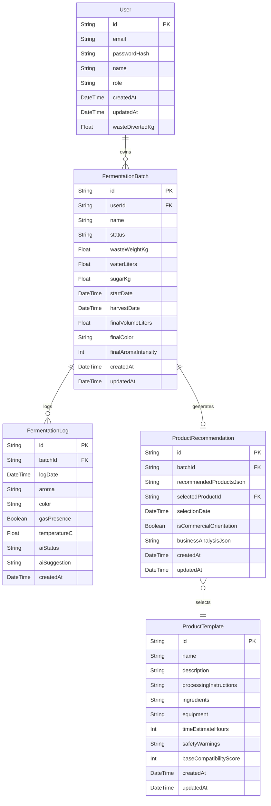

# DATABASE.md: EcoFlow AI

## 1. Entity Relationship Diagram (ERD)

The following ERD illustrates the core entities within the EcoFlow AI platform and their relationships. It focuses on the primary business logic concerning user management, fermentation tracking, product recommendations, and derivative product definitions.



## 2. Table Definitions

This section details the five core tables central to the EcoFlow AI platform's operations.

### User

Stores user authentication and profile information.
| Field | Type | Description |
|:---|:---|:---|
| `id` | String (PK) | Unique identifier for the user. |
| `email` | String (UK) | User's email address, used for login. |
| `passwordHash` | String | Hashed password for security. |
| `name` | String | User's full name. |
| `role` | String | User's role (e.g., 'HOUSEHOLD', 'UMKM', 'COMMUNITY_ADMIN', 'PLATFORM_ADMIN'). |
| `createdAt` | DateTime | Timestamp of user creation. |
| `updatedAt` | DateTime | Timestamp of last update. |
| `wasteDivertedKg` | Float | Cumulative organic waste (kg) diverted by the user. |

### FermentationBatch

Represents a single eco-enzyme fermentation process initiated by a user.
| Field | Type | Description |
|:---|:---|:---|
| `id` | String (PK) | Unique identifier for the fermentation batch. |
| `userId` | String (FK) | ID of the user who owns this batch. |
| `name` | String | User-defined name for the batch. |
| `status` | String | Current status of the batch (e.g., 'IN_PROGRESS', 'HARVESTED', 'FAILED'). |
| `wasteWeightKg` | Float | Initial weight of organic waste in kilograms. |
| `waterLiters` | Float | Initial volume of water in liters. |
| `sugarKg` | Float | Initial weight of sugar in kilograms. |
| `startDate` | DateTime | Date when the fermentation started. |
| `harvestDate` | DateTime | Date when the eco-enzyme was harvested (nullable). |
| `finalVolumeLiters` | Float | Final volume of harvested eco-enzyme (nullable). |
| `finalColor` | String | Descriptive color or hex code of the harvested eco-enzyme (nullable). |
| `finalAromaIntensity` | Int | Aroma intensity of harvested eco-enzyme (1-10) (nullable). |
| `createdAt` | DateTime | Timestamp of batch creation. |
| `updatedAt` | DateTime | Timestamp of last update. |

### FermentationLog

Records periodic observations and AI feedback for a specific `FermentationBatch`.
| Field | Type | Description |
|:---|:---|:---|
| `id` | String (PK) | Unique identifier for the log entry. |
| `batchId` | String (FK) | ID of the fermentation batch this log belongs to. |
| `logDate` | DateTime | Date and time of the log entry. |
| `aroma` | String | Observed aroma (e.g., 'SWEET', 'SOUR', 'ROTTEN', 'NORMAL'). |
| `color` | String | Observed color (e.g., hex code or descriptive). |
| `gasPresence` | Boolean | Indicates if gas bubbles were observed. |
| `temperatureC` | Float | Observed temperature in Celsius (nullable). |
| `aiStatus` | String | AI's assessment of the fermentation status (e.g., 'NORMAL', 'CAUTION', 'FAILED'). |
| `aiSuggestion` | String | AI's suggested corrective action (nullable). |
| `createdAt` | DateTime | Timestamp of log creation. |

### ProductTemplate

Defines the various eco-enzyme derivative products and their processing instructions.
| Field | Type | Description |
|:---|:---|:---|
| `id` | String (PK) | Unique identifier for the product template. |
| `name` | String (UK) | Name of the derivative product (e.g., 'Household Cleaner'). |
| `description` | String | Brief description of the product. |
| `processingInstructions` | String | Detailed step-by-step guide for making the product. |
| `ingredients` | String | JSON string listing required additional ingredients. |
| `equipment` | String | JSON string listing required equipment. |
| `timeEstimateHours` | Int | Estimated time to process the product in hours (nullable). |
| `safetyWarnings` | String | Important safety considerations (nullable). |
| `baseCompatibilityScore` | Int | Base score for AI recommendation ranking. |
| `createdAt` | DateTime | Timestamp of template creation. |
| `updatedAt` | DateTime | Timestamp of last update. |

### ProductRecommendation

Stores the AI's recommendations for a harvested eco-enzyme batch and the user's selection. Also includes business analysis data for UMKM.
| Field | Type | Description |
|:---|:---|:---|
| `id` | String (PK) | Unique identifier for the recommendation record. |
| `batchId` | String (FK, UK) | ID of the harvested fermentation batch. Unique per batch. |
| `recommendedProductsJson` | String | JSON array of recommended product IDs and their compatibility scores. |
| `selectedProductId` | String (FK) | ID of the `ProductTemplate` chosen by the user (nullable). |
| `selectionDate` | DateTime | Date when the user made a product selection (nullable). |
| `isCommercialOrientation` | Boolean | True if the user intends commercial use (UMKM). |
| `businessAnalysisJson` | String | JSON object containing financial analysis (COGS, SRP, profit projection) for UMKM (nullable). |
| `createdAt` | DateTime | Timestamp of recommendation generation. |
| `updatedAt` | DateTime | Timestamp of last update. |

## 3. Prisma Schema

```prisma
// This is your Prisma schema file,
// learn more about it in the docs: https://pris.ly/d/prisma-schema

generator client {
  provider = "prisma-client-js"
}

datasource db {
  provider = "postgresql"
  url      = env("DATABASE_URL")
}

model User {
  id               String            @id @default(cuid())
  email            String            @unique
  passwordHash     String
  name             String
  role             String // e.g., 'HOUSEHOLD', 'UMKM', 'COMMUNITY_ADMIN', 'PLATFORM_ADMIN'
  createdAt        DateTime          @default(now())
  updatedAt        DateTime          @updatedAt
  wasteDivertedKg  Float             @default(0.0)

  fermentationBatches FermentationBatch[]
}

model FermentationBatch {
  id                   String                 @id @default(cuid())
  userId               String
  name                 String
  status               String // e.g., 'IN_PROGRESS', 'CAUTION', 'FAILED', 'HARVESTED', 'PROCESSED'
  wasteWeightKg        Float
  waterLiters          Float
  sugarKg              Float
  startDate            DateTime
  harvestDate          DateTime?
  finalVolumeLiters    Float?
  finalColor           String? // e.g., hex code or descriptive
  finalAromaIntensity  Int? // 1-10

  createdAt            DateTime               @default(now())
  updatedAt            DateTime               @updatedAt

  user                 User                   @relation(fields: [userId], references: [id])
  fermentationLogs     FermentationLog[]
  productRecommendation ProductRecommendation?
}

model FermentationLog {
  id           String   @id @default(cuid())
  batchId      String
  logDate      DateTime
  aroma        String // e.g., 'SWEET', 'SOUR', 'ROTTEN', 'NORMAL'
  color        String // e.g., hex code or descriptive
  gasPresence  Boolean
  temperatureC Float?
  aiStatus     String? // e.g., 'NORMAL', 'CAUTION', 'FAILED'
  aiSuggestion String?

  createdAt    DateTime @default(now())

  fermentationBatch FermentationBatch @relation(fields: [batchId], references: [id])
}

model ProductTemplate {
  id                     String                @id @default(cuid())
  name                   String                @unique // e.g., 'Household Cleaner', 'Liquid Fertilizer'
  description            String?
  processingInstructions String
  ingredients            Json // JSON string listing required additional ingredients
  equipment              Json // JSON string listing required equipment
  timeEstimateHours      Int?
  safetyWarnings         String?
  baseCompatibilityScore Int                   @default(50)

  createdAt              DateTime              @default(now())
  updatedAt              DateTime              @updatedAt

  productRecommendations ProductRecommendation[] @relation("SelectedProduct")
}

model ProductRecommendation {
  id                      String    @id @default(cuid())
  batchId                 String    @unique
  recommendedProductsJson Json // JSON array of {productId, compatibilityScore, rank}
  selectedProductId       String?
  selectionDate           DateTime?
  isCommercialOrientation Boolean   @default(false)
  businessAnalysisJson    Json? // JSON object for COGS, SRP, profit projection

  createdAt               DateTime  @default(now())
  updatedAt               DateTime  @updatedAt

  fermentationBatch       FermentationBatch @relation(fields: [batchId], references: [id])
  selectedProduct         ProductTemplate?  @relation("SelectedProduct", fields: [selectedProductId], references: [id])
}
```